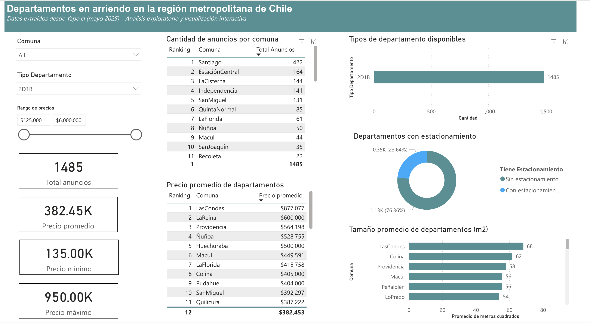

# Análisis de departamentos en arriendo en la Región Metropolitana (Yapo.cl - mayo 2025)

Este proyecto integra recolección de datos, análisis exploratorio y visualización interactiva para examinar el mercado de arriendo de departamentos publicados en el portal Yapo.cl durante mayo de 2025 en la Región Metropolitana de Chile.

## Objetivos

- Obtener datos actuales de arriendo desde Yapo.cl mediante técnicas de web scraping.
- Realizar un análisis exploratorio de los principales indicadores del mercado de arriendo.
- Diseñar un dashboard interactivo en Power BI para facilitar la comprensión de los datos.

## ¿Por qué Yapo.cl?

Yapo.cl es uno de los portales de clasificados más populares en Chile, utilizado activamente por propietarios y corredores para publicar arriendos. Su alto volumen de publicaciones y categorización clara lo convierten en una fuente representativa y accesible para obtener datos actuales del mercado inmobiliario. Además, su estructura permite automatizar la extracción de información mediante técnicas de scraping.


Pagina web de yapo.cl

## Tecnologías utilizadas

- **Python 3** (web scraping y análisis)
  - Requests
  - BeautifulSoup
  - pandas
  - numpy
- **Jupyter Notebook** (EDA)
- **Power BI** (visualización interactiva)
- **Yapo.cl** como fuente de datos

## Resumen de Modificaciones a los Datos

### Limpieza y Normalización (Python - EDA)

#### Datos Originales
- 12,690 registros iniciales
- Columnas: Título, Comuna, Precio, Metros Cuadrados, Dormitorios, Baños, Estacionamientos
- Problemas detectados: formatos inconsistentes, valores nulos, duplicados

#### Modificaciones Principales

##### Precios
- Separación de precios de texto adicional (ej: `$350.000 - Oportunidad` → `350000`)
- Conversión de UF a CLP (tasa: 1 UF = 39,184 CLP)
- Corrección de errores (ej: `UF500.000` → interpretado como CLP)
- Eliminación de precios > $10M (posibles ventas)

##### Metros Cuadrados
- Extracción numérica de textos (ej: `50m2` → `50`)
- Imputación de nulos usando mediana por número de dormitorios
- Creación de flag `Metros_Imputados` para registros ajustados

##### Otras Columnas
- **Dormitorios**: Imputación con moda por comuna
- **Baños**: Imputación basada en dormitorios (mínimo 1 baño)
- **Estacionamientos**: Nulos convertidos a 0 (asumiendo "no especificado = 0")

##### Limpieza Adicional
- Eliminación de 4,908 duplicados (de 12,690 a 7,782 registros)
- Filtrado de outliers (percentiles 1% y 99% para precios)

### Transformaciones en Power BI

#### **Modificaciones Destacadas**

**Filtrado de Datos**:
   - Exclusión de propiedades con:
     - Metros cuadrados ≥ 1000 (posibles errores)
     - Estacionamientos = 10 (outlier)
     - Títulos que contienen "pieza" o "Pieza" (no departamentos)
     - Títulos que comienzan con "Busco" (demandas, no ofertas)
     - Dormitorios = 11 (outlier)
     - Precios < $100,000 CLP (no realistas)

## Principales resultados

El análisis identificó:

- Las comunas con más anuncios de arriendo.
- El rango y promedio de precios de departamentos.
- La distribución por tipo de unidad (1D1B, 2D2B, etc.).
- La proporción de departamentos con y sin estacionamiento.
- Tamaño promedio de departamentos según comuna.

Puedes revisar el dashboard interactivo en Power BI [aquí](https://app.powerbi.com/view?r=eyJrIjoiN2U1MDkzYTgtZmRjNS00NDQ0LTkyYTEtMTNmNWE2NTNmN2JjIiwidCI6IjYwZjlmYmU3LTY3ZjMtNGE0OS1hZDkwLTNkMjYxZjkyMDRjMSJ9).


Dashboard interactivo terminado
## Cómo ejecutar el proyecto

1. Clona este repositorio.
2. Instala las dependencias:
   ```bash
   pip install -r requirements.txt
3. Ejecuta el script de scraping:
   ```bash
   python scripts/scraping_yapo_departamentos.py
4. Revisa el análisis exploratorio en:
   ```bash
   notebooks/eda_departamentos_rm.ipynb


