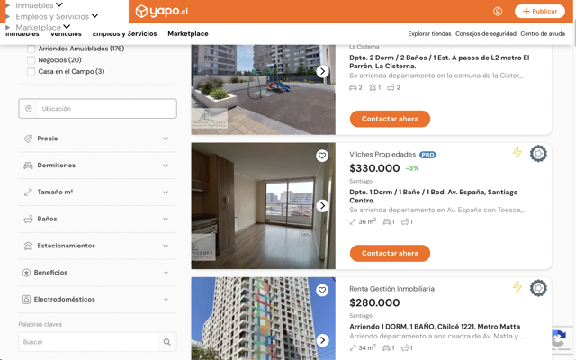

# Apartment Rental Analysis – Santiago Metropolitan Region (Yapo.cl, May 2025)

This project integrates **data scraping**, **exploratory data analysis (EDA)**, and **interactive visualization** to examine the apartment rental market in Santiago, Chile. Data was collected from [Yapo.cl](https://www.yapo.cl) on **May 30, 2025** using Python.

---

## Objectives

- Collect current rental listings using web scraping from Yapo.cl.
- Perform EDA on key rental market indicators.
- Build an interactive **Power BI** dashboard for business insight.

---

## Why Yapo.cl?

[Yapo.cl](https://www.yapo.cl) is one of Chile’s most used classifieds websites. It is frequently updated by landlords and real estate agents and provides:

- High listing volume
- Standardized category structure
- Publicly accessible data (suitable for automated extraction)

This makes it an ideal real estate data source for real-time rental analysis.



---

## Tech Stack

| Tool | Purpose |
|------|---------|
| **Python 3** | Web scraping, cleaning, and preprocessing |
| `requests` + `BeautifulSoup` | Scraping HTML content |
| `pandas` + `numpy` | Data wrangling |
| **Jupyter Notebook** | EDA workflow |
| **Power BI** | Interactive dashboard and reporting |
| **Yapo.cl** | Data source |

---

---

## Data Cleaning Summary

### Raw Data
- 12,690 records
- Columns: Title, Municipality, Price, Size (m²), Bedrooms, Bathrooms, Parking
- Issues: Inconsistent formats, nulls, duplicates

### Key Cleaning Steps (Python)

#### Price
- Removed non-numeric text (e.g. `$350.000 - Oportunidad` → `350000`)
- Converted **UF → CLP** at 1 UF = 39,184 CLP
- Removed outliers > $10M CLP (likely sales)

#### Square Meters
- Extracted numeric values (e.g. `50m2` → `50`)
- Imputed missing values (median by bedroom count)
- Added `Metros_Imputados` flag

#### Other Columns
- **Bedrooms**: Imputed using mode per municipality
- **Bathrooms**: Imputed based on number of bedrooms
- **Parking Spaces**: Nulls set to 0 (assumed “not specified”)

#### Additional Cleaning
- Removed **4,908 duplicates**
- Trimmed outliers (1st–99th percentile of price)

---

## Power BI Filtering & Modeling

### Records Removed If:
- Size ≥ 1000 m² (likely incorrect)
- Parking = 10 (outlier)
- Title includes *"pieza"* or starts with *"busco"*
- Bedrooms = 11
- Price < $100,000 CLP (unrealistic)

---

## Key Insights

- Most frequently listed municipalities
- Rental price range and averages
- Distribution by unit type (e.g. 1BR1BA, 2BR2BA)
- Parking availability share
- Average apartment size per municipality

Explore the interactive dashboard [**here**](https://app.powerbi.com/view?r=eyJrIjoiN2U1MDkzYTgtZmRjNS00NDQ0LTkyYTEtMTNmNWE2NTNmN2JjIiwidCI6IjYwZjlmYmU3LTY3ZjMtNGE0OS1hZDkwLTNkMjYxZjkyMDRjMSJ9).


---

## How to Run the Project

```bash
# 1. Clone this repo
git clone https://github.com/yourusername/your-repo-name.git

# 2. Install dependencies
pip install -r requirements.txt

# 3. Run the scraper (optional: specify region & pages)
jupyter notebook notebooks/scraping_yapo_departamentos.ipynb

# 4. Run the EDA notebook
jupyter notebook notebooks/eda_departamentos_rm.ipynb


